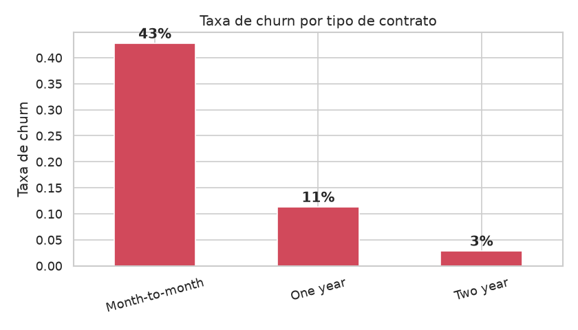
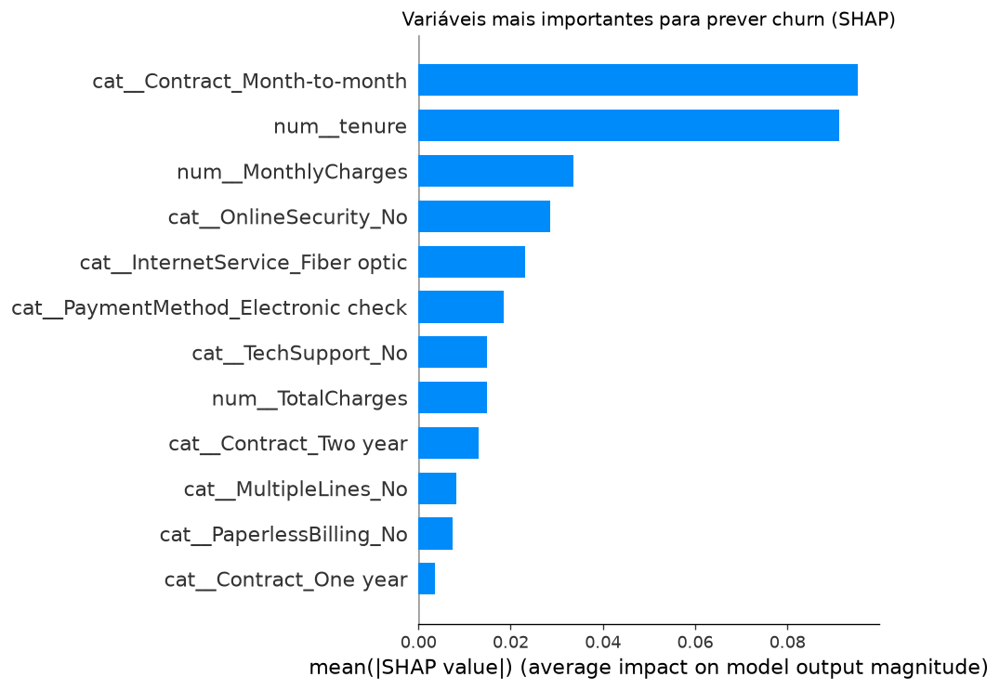

# Previsão de Churn em Telecomunicações

[](https://telco-churn-prediction-cnktkq7fq58cgeir8h8yjg.streamlit.app/)
[](https://github.com/heltrakinho07/telco-churn-prediction/actions/workflows/ci.yml)


Modelo de Machine Learning que prevê **que clientes vão cancelar o serviço**
numa operadora de telecomunicações, permitindo agir *antes* de os perder.

> **Porque importa:** reter um cliente custa até **5x menos** do que angariar um
> novo. Antecipar o churn permite campanhas de retenção dirigidas e poupança real.

---

## O problema de negócio

Uma operadora perde **26.5%** dos seus clientes (churn). Cada cliente que sai
representa receita perdida e custo de reaquisição. Este projeto responde a:

- **Quem** está em risco de sair?
- **Porquê** saem os clientes?
- Quanto vale, em meticais (MZN), atuar sobre isso?

## Principais descobertas (EDA)

| Fator | Descoberta |
|---|---|
| **Tipo de contrato** | Contratos mensais: **42.7%** de churn vs. **2.8%** nos de 2 anos |
| **Tempo de casa** | A maioria do churn acontece nos primeiros meses |
| **Desequilíbrio** | Só 26.5% dos clientes fazem churn -> problema de classes desbalanceadas |



## Modelo e resultados

Comparámos dois modelos com **validação cruzada (5 folds)** para garantir que os
resultados são **consistentes** e não fruto de uma divisão específica dos dados.

| Modelo | ROC-AUC | Recall (churn) | Precision | Estabilidade (dp) |
|---|---|---|---|---|
| Regressão Logística (baseline) | 0.845 | 0.80 | 0.51 | ± 0.013 |
| **HistGradientBoosting** | 0.842 | 0.78 | 0.53 | ± 0.012 |

> **Insight:** os dois modelos são equivalentes e muito estáveis (desvio-padrão
> ~0.01). Neste dataset, o modelo mais complexo **não** supera o simples — um bom
> lembrete de que complexidade nem sempre traz ganho.

> Num problema de churn, **recall importa mais que accuracy**: é melhor avisar a
> mais do que deixar escapar clientes que iam mesmo sair.

### Explicabilidade (SHAP)

O modelo é explicável: as variáveis que mais pesam no churn são o **tipo de
contrato (mensal)**, o **tempo de casa (tenure)** e os **encargos mensais**.



### Retorno de negócio (ROI)

Simulando uma campanha de retenção guiada pelo modelo (pressupostos ajustáveis
em [src/roi.py](src/roi.py)):

| Indicador | Valor |
|---|---|
| Lucro líquido (conj. de teste) | **359 400 MZN** |
| ROI | **211.7%** |

Por cada metical investido na campanha, retornam ~3.1 MZN.

## Demo

**▶️ Experimenta a demo ao vivo:** https://telco-churn-prediction-cnktkq7fq58cgeir8h8yjg.streamlit.app/

Preenche os dados de um cliente e o modelo estima a probabilidade de churn em tempo real.

A interface tem três módulos:

| Módulo | O que faz |
|---|---|
| **Previsor de Churn (Individual)** | Formulário em abas + velocímetro de risco e recomendação de retenção |
| **Previsão Completa (19 Parâmetros)** | Previsão usando todos os parâmetros do modelo, com o peso de cada um, a tabela completa e um plano de retenção simulado |
| **Visão Global (Analítica)** | KPIs de carteira e principais drivers de churn |

Corre a demo localmente:

```bash
streamlit run app/streamlit_app.py          # interface visual
uvicorn api.main:app --reload               # API REST (ver /docs)
```

## Estrutura do projeto

```
telco-churn-prediction/
├── data/
│   ├── raw/            # Dados originais (não versionados)
│   └── processed/      # Dados limpos
├── notebooks/          # Exploração interativa
├── src/
│   ├── config.py           # Caminhos e constantes
│   ├── data_prep.py        # Limpeza de dados
│   ├── eda.py              # Análise exploratória + gráficos
│   ├── train.py            # Modelo baseline (Fase 1)
│   ├── train_advanced.py   # Gradient Boosting + validação cruzada (Fase 2)
│   ├── explain.py          # Explicabilidade com SHAP (Fase 2)
│   ├── roi.py              # Análise de retorno em meticais (Fase 2)
│   ├── predict.py          # Lógica de previsão partilhada (Fase 3)
│   └── train_mlflow.py     # Treino com tracking MLflow (Fase 4)
├── api/main.py         # API REST — FastAPI (Fase 3)
├── app/streamlit_app.py# Interface visual — Streamlit (Fase 3)
├── tests/              # Testes automáticos — pytest (Fase 4)
├── .github/workflows/  # CI/CD — GitHub Actions (Fase 4)
├── models/             # Modelos treinados
├── reports/figures/    # Gráficos gerados
├── Dockerfile          # Deploy da interface (Streamlit)
├── Dockerfile.api      # Container da API REST
├── requirements.txt    # Dependências mínimas (deploy)
└── requirements-dev.txt# Dependências completas (desenvolvimento)
```

## Como executar

```bash
# 1. Criar ambiente virtual
python3 -m venv .venv
source .venv/bin/activate

# 2. Instalar dependências (ambiente completo de desenvolvimento)
pip install -r requirements-dev.txt

# 3. Correr o pipeline
cd src
python data_prep.py    # Limpar dados
python eda.py          # Gerar análise e gráficos
python train.py        # Treinar e avaliar o modelo
```

## Roadmap

- [x] **Fase 1** — Fundação: EDA + modelo baseline
- [x] **Fase 2** — Gradient Boosting + validação cruzada + SHAP + análise de ROI
- [x] **Fase 3** — Deploy: API (FastAPI) + interface (Streamlit) + Docker
- [x] **Fase 4** — MLOps: testes (pytest), CI/CD (GitHub Actions), tracking (MLflow)

## Qualidade e MLOps

- **Testes automáticos** (`pytest`) — validam a limpeza de dados e a lógica de
  previsão. Corre com `pytest tests/`.
- **CI/CD** (GitHub Actions) — a cada `push`, os testes correm automaticamente
  (ver o badge no topo). Código que parte não passa despercebido.
- **Tracking de experiências** (MLflow) — cada treino regista parâmetros,
  métricas e o modelo. Corre `python src/train_mlflow.py` e visualiza com
  `mlflow ui --backend-store-uri sqlite:///mlflow.db`.

## Tecnologias

`Python` · `pandas` · `scikit-learn` · `SHAP` · `FastAPI` · `Streamlit`
`Docker` · `pytest` · `GitHub Actions` · `MLflow`

---

*Projeto desenvolvido para demonstrar competências de Data Science aplicadas ao
setor das telecomunicações.*
